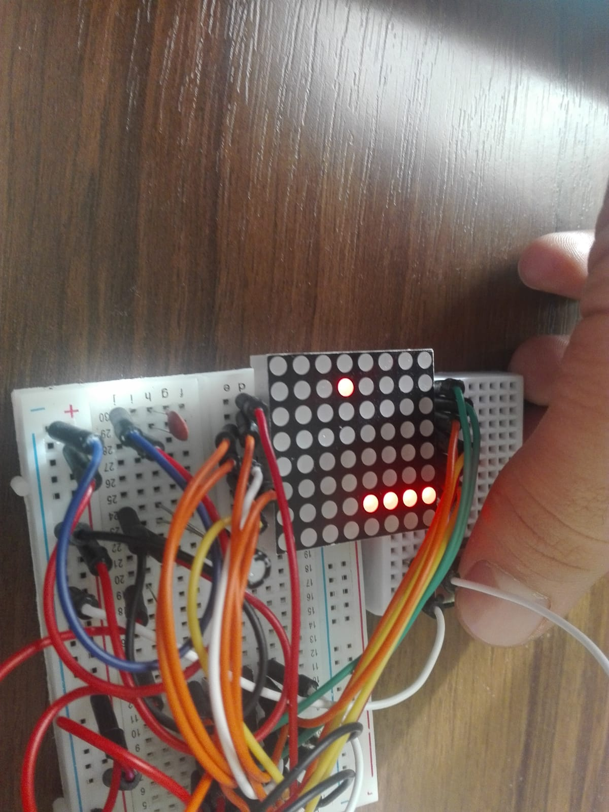
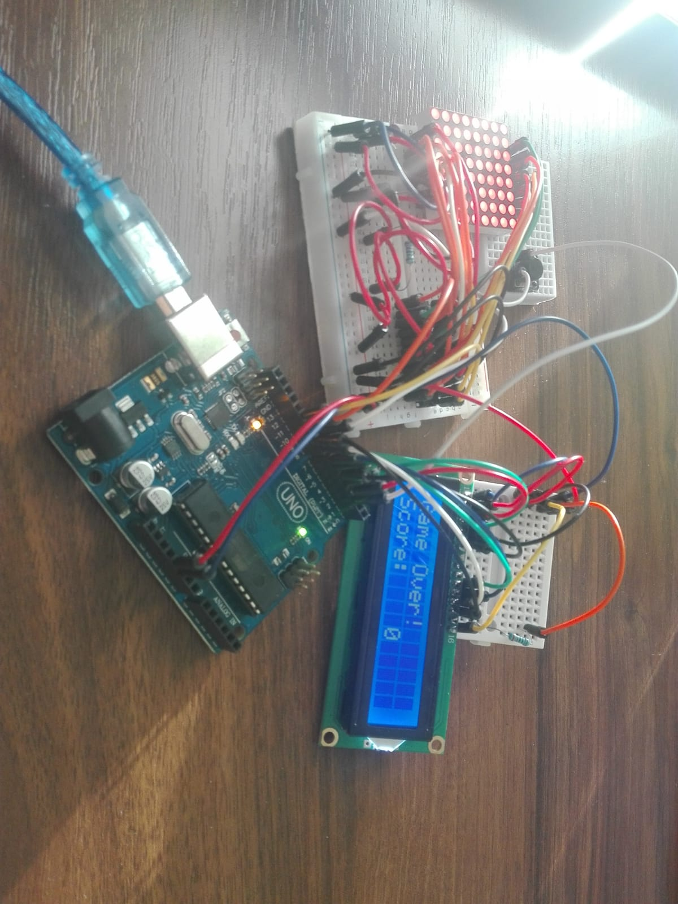

# Arduino Flappy Bird

Arduino Flappy Bird is a clone of Flappy Bird game, but using as display an 8x8 led matrix and Arduino Uno microcontroller. 
<a href="https://www.youtube.com/watch?v=_SPNHZvE2DY">Demo Video</a>

## Structure
**lib** folder contains almost all the code:
* lib/bird: there is all the bird logic(movement, colision, ...)
* lib/pipe: there is all the pipe logic(movement, colision, ...)
* lib/display: there is an interface for easily controlling the 8x8 led matrix and lcd screen
* lib/gamecontroller: this controls all game logic(frame update, lcd display messages, what happens when bird die, score keeping, ...)
* src/main: just call gamecontroller function
